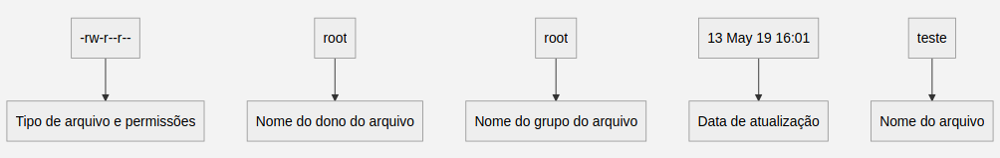
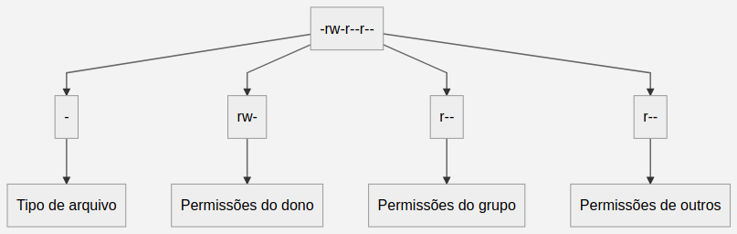
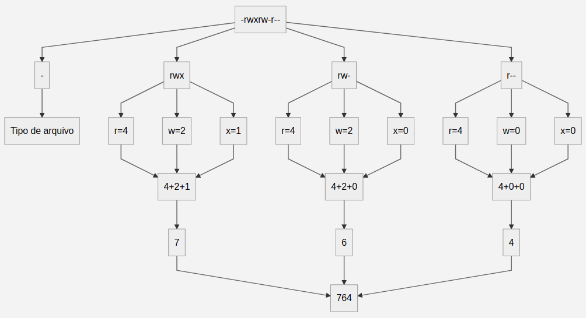

# Permissões de acesso

As permissões de acesso protegem o sistema de arquivos do GNU/Linux do uso indevido de pessoas ou programas não autorizados. Para proporcionar essa segurança, o GNU/Linux define o acesso aos arquivos por donos, grupos e outros usuários. A seguir, cada um deles serão explicados:

 - Dono: É a pessoa que criou o arquivo, só ela pode modificar as permissões de acesso dele. O seu nome é o mesmo do usuário usado para entrar no GNU/Linux, mas também é possível identifica-lo por um número chamado *UID*, abreviação de *User ID* — para vê-lo basta executar o comando `id -u`.
 - Grupo: Permite que vários usuários diferentes tenham acesso a um mesmo arquivo — cada usuário pode fazer parte de um ou mais grupos. Eles podem ser identificados pelo nome utilizado no momento de sua criação ou por um número chamado *GID*, abreviação de *Group ID* — para vê-lo basta executar o comando `id -g`.
 - Outros: É a categoria de usuários que não são donos ou não pertencem ao grupo do arquivo.

## Tipos de permissões de acesso

No GNU/Linux existem três permissões básicas, são selas:

- `r`: Permissão de leitura para arquivos.
- `w`: Permissão de gravação para arquivos — também permite a exclusão do arquivo.
- `x`: Permite a execução do arquivo, caso seja um programa executável. Se o arquivo for um diretório, permite que seja acessado através do comando `cd`.

Essas permissões se aplicam ao dono, grupo e outros. Para visualizá-las basta utilizar a opção `-l` do comando `ls` — para mais detalhes desse comando, basta visitar a seção "Controle de Permissões" deste manual. Ao executá-lo, a saída obtida será algo semelhante a isto `-rw-r--r-- root  root  13 May 19 16:01 teste`, onde:

Para poder ler as informações da primeira sequencia de caracteres — Tipo de arquivo e permissões  —  é preciso saber que: 

- O primeiro caractere representa o tipo de arquivo. Ele pode ser:
	-  `-`: regular;
	-   `d`: diretório;
	-   `l`: *link* simbólico;
	-   `b`: bloco;
	-   `c`:  caractere;
	-   `p`: *pipe*;
	-   `s`: *socket*
- Do segundo ao quarto caractere, são as permissão de acesso do dono do arquivo.  
- Do quinto ao sétimo caractere, são as permissão de acesso do grupo do arquivo. 
- Do oitavo ao décimo caractere, são as permissão de acesso dos outros usuários. 

### Permissões na notação octal

É possível escrever as permissões com números por meio da notação octal. Ela é uma forma mais objetiva de escrita, pois você especifica diretamente a permissão do dono, grupo e outros. A correspondência dessa notação com a convencional é a seguinte:

- 1 equivale ao `x`;
- 2 equivale ao `w`;
- 4 equivale ao `r`.

Sabendo disso, já é possível converter as permissões para a notação octal, veja o exemplo:

 - Primeiro: divide-se as permissões de usuário, grupo e outros;
 - Segundo: Verificar quais permissões foram dadas para cada perfil e efetuar a conversão;
 - Terceiro: Efetuar a soma das permissões dadas para cada perfil;
 - Quarto: Agrupar o resultado do somatório de cada perfil para obter as permissões no formato octal.

# Manipulando permissões

A seguir serão listados os comandos utilizados para manipular as permissões dos arquivos.

## `chmod`

- Utilidade: Alterar as permissões de acesso.
- Estrutura: `chmod` *`[opções]`* *`[permissões]`* *`[caminho/arquivo]`*.
- Opções:
	- `-R`: Muda permissões de acesso do diretório atual e dos arquivos e subdiretórios contidos nele.
- Permissões: Para definir as permissões com a notação convencional é preciso informar três coisas:
	- O que deseja editar — dono(`u`), grupo(`g`) ou outro(`o`);
	- A ação que deseja efetuar — adicionar(`+`), remover(`-`) ou redefinir(`=`) as permissões;
	- A permissão no formato convencional — leitura(`r`), escrita(`w`) ou execução(`e`).
- Macetes:
	- É mais fácil editar permissões utilizando a notação octal, pois é possível alterar as permissões do dono, grupo ou outro. Para isso, basta colocar o código octal correspondente ao conjunto de permissões que deseja conceder.	

## `chown`

- Utilidade: Muda dono de um arquivo — opcionalmente pode também ser usado para mudar o grupo.
- Estrutura: `chown` *`[opções]`* *`[dono:grupo]`* *`[caminho/arquivo]`*
- Opções:
	- `-R`: Muda permissões de acesso do diretório atual e dos arquivos e subdiretórios contidos nele.

## `setfacl`
- Utilidade: permite personalizar permissões para usuários ou grupos específicos.
- Estrutura: `setfacl` *`[opções]`* *`[mascara]`* *`[caminho/arquivo]`*.
- Opções: 
	- `-m`: indica o desejo de modificar usuário ou grupo que tem acesso ao arquivo;
	- `-x`: indica o desejo de excluir as permissões dadas para alguém.
	- `-R`: Muda permissões de acesso do diretório atual e dos arquivos e subdiretórios contidos nele.
- Mascara:  Para definir as permissões é preciso informar:
	- O que será editado — usuário(`user:`)  ou grupo(`group:`);
	- Indicar o nome de quem receberá as permissões especiais, com `:` ao fim;
	- Por fim, indicar as permissões dadas — podendo ser feito com a notação convencional quanto na octal.

## `getfacl`

- Utilidade: Visualizar usuários, grupos e suas respectivas permissões de um arquivo.
- Estrutura: `getfacl` *`[opções]`* *`[mascara]`* *`[caminho/arquivo]`*.

